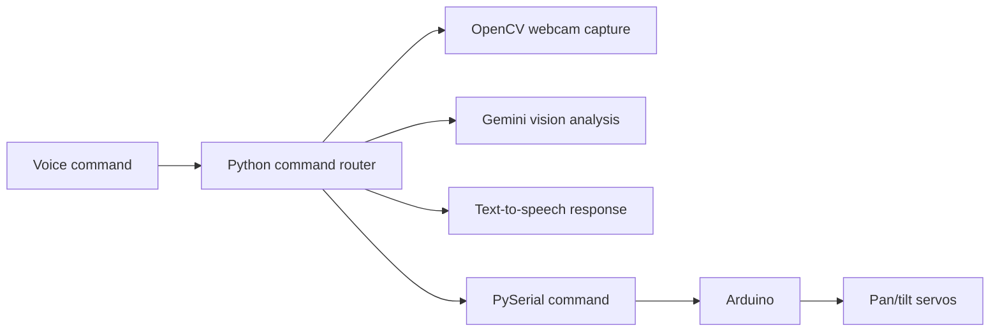

# Jarvis Vision Assistant

A work-in-progress voice-controlled vision assistant that combines Python, Arduino, webcam capture, text-to-speech, Gemini vision, and pan/tilt servo control.

Jarvis listens for voice commands, moves a camera mount through serial commands, captures webcam frames, and can use Gemini to describe scenes or help solve visible math problems. This is a prototype, but it demonstrates real hardware/software integration across audio input, camera processing, AI vision, and Arduino control.

## Demo

[Watch the LinkedIn demo](https://www.linkedin.com/posts/kennedynguyen216_opencv-lsu-jarvis-activity-7462261857047851008-hy47?utm_source=share&utm_medium=member_desktop&rcm=ACoAAF8fJLQBrwnGUubY5rvjq77M4HRz8dQfgTA)

This repo is documented as a prototype, and the demo shows the hardware/software loop in action: voice input, camera movement, computer vision, and spoken responses.

## How It Works



## Highlights

- Wake-word command routing with speech recognition.
- Pan/tilt servo control through Arduino serial messages.
- OpenCV camera preview and frame capture.
- Gemini vision calls for image understanding and math-problem solving.
- Text-to-speech output using Windows SAPI or `pyttsx3`.
- Small hardware test scripts for serial, pan movement, vision capture, TTS, and servo detach behavior.

## What It Demonstrates

| Area | Evidence in this project |
|---|---|
| Computer vision | Captures webcam frames with OpenCV and sends selected images to Gemini. |
| Hardware control | Sends serial commands to an Arduino that controls pan/tilt servos. |
| Voice interface | Uses speech recognition for commands and TTS for spoken responses. |
| Prototype discipline | Includes focused test scripts for individual hardware/software subsystems. |

## Tech Stack

- Python
- Arduino / C++
- OpenCV
- PySerial
- SpeechRecognition
- pyttsx3 / Windows SAPI
- Google Gemini API
- Pillow
- python-dotenv

## Project Structure

- `jarvis.py`: Main assistant application.
- `jarvis_arduino.ino`: Arduino sketch for pan/tilt servo control.
- `jarvis_test_*.py`: Focused tests for voice, vision, TTS, serial, and servo movement.
- `jarvis_set_position.py`: Utility for manually setting pan/tilt angles.
- `jarvis_detach_servos.py`: Utility for detaching servos.
- `.env.example`: Example local configuration.
- `requirements.txt`: Python dependencies.

## Setup

Create and activate a virtual environment:

```bash
python -m venv .venv
.venv\Scripts\activate
pip install -r requirements.txt
```

Copy the example environment file:

```bash
copy .env.example .env
```

Important environment variables:

- `GOOGLE_API_KEY`: Gemini API key for vision features.
- `JARVIS_SERIAL_PORT`: Arduino serial port, for example `COM3`.
- `JARVIS_CAMERA_INDEX`: OpenCV camera index.
- `JARVIS_MIC_INDEX`: Optional microphone device index.
- `JARVIS_HOME_PAN` / `JARVIS_HOME_TILT`: Starting servo position.

## Running

Upload `jarvis_arduino.ino` to the Arduino, connect the camera/microphone, then run:

```bash
python jarvis.py
```

Example utility commands:

```bash
python jarvis_test_serial.py
python jarvis_test_vision.py
python jarvis_set_position.py 105 82
```

## Portfolio Notes

- Add a photo of the camera/servo mount when available.
- Add a local GIF or video asset when available so visitors can preview the demo directly from GitHub.
- Keep `.env` local; `.env.example` documents the expected configuration without exposing keys.

## Status

Prototype / work in progress. Current limitations include machine-specific audio and camera setup, serial-port calibration, local `.env` configuration, and command phrases that are still evolving. Good next steps would be adding mocked tests for command parsing and separating hardware adapters behind small interfaces.
